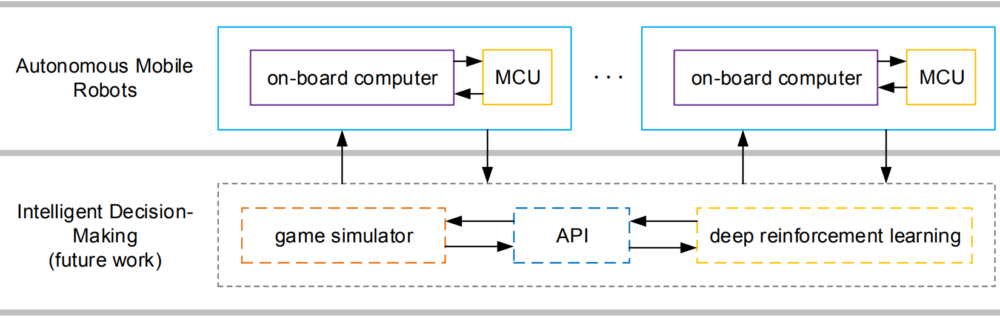

# RoboRTS
[](https://travis-ci.org/RoboMaster/RoboRTS)
[](https://gitter.im/RoboMaster/RoboRTS?utm_source=badge&utm_medium=badge&utm_campaign=pr-badge)

## Introduction


RoboRTS is an open source software stack for Real-Time Strategy research on mobile robots, developed by RoboMaster and motivated by [RoboMaster AI Challenge](#competition)

The framework of RoboRTS consists two parts: autonomous mobile robot layer and intelligent decision-making layer.



The autonomous mobile robot layer alone can let a robot, offically supported for RoboMaster AI Robot platform, to demonstrate a certain level of intelligence. On its on-board computer runs perception, motion planning, decision modules. It is fully supported in ROS with community driven as well as platform-customized codes and examples. On its MCU, an RT low-level robot controller is implemented to govern the robot driving system.  

**TODO:** Intelligent decision-making layer includes a multi-agent decision-making framework and a game simulator, it will be released soon in the future.

## Installation

Install ros dependencies:

```
sudo apt-get install -y ros-kinetic-opencv3             \
                        ros-kinetic-cv-bridge           \
                        ros-kinetic-image-transport     \
                        ros-kinetic-stage-ros           \
                        ros-kinetic-map-server          \
                        ros-kinetic-laser-geometry      \
                        ros-kinetic-interactive-markers \
                        ros-kinetic-tf                  \
                        ros-kinetic-pcl-*               \
                        ros-kinetic-libg2o              \
                        ros-kinetic-rplidar-ros         \
                        ros-kinetic-rviz                \
                        protobuf-compiler               \
                        libprotobuf-dev                 \
                        libsuitesparse-dev              \
                        libgoogle-glog-dev              
```

Create serial port mapping rules:

``
sh roborts_bringup/scripts/udev/create_udev_rules.sh
``

Reload udev service

```
  sudo service udev reload
  sudo service udev restart
```

Download and compile
```
mkdir -p roborts_ws/src
cd roborts_ws/src
git clone https://github.com/yuqi1991/RoboRTS.git
cd ..
catkin_make 
source devel/setup.bash
```


## Tutorial

For more information about RoboMaster AI Robot platform and RoboRTS framework, please refer to [RoboRTS Tutorial](https://robomaster.github.io/RoboRTS-Tutorial/#/)

## Competition

RoboMaster holds AI Challenge since 2017. In the challenge, multiple robots should fight with each other on a game field automatically under different rules.

For more information, please refer to

- [DJI RoboMaster 2019 ICRA AI Challenge](https://icra2019.org/competitions/dji-robomaster-ai-challenge)

- [DJI RoboMaster 2018 ICRA AI Challenge](https://icra2018.org/dji-robomaster-ai-challenge/)

## Copyright and License

RoboRTS is provided under the [GPL-v3](COPYING).
